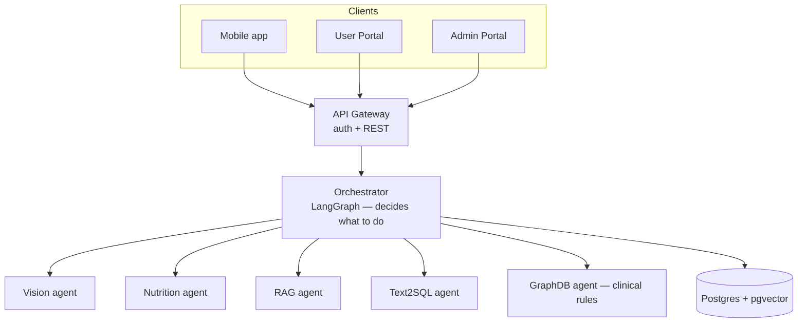

# NutriAgent AI

**Take a photo of your meal. Get calories, macros, and nutrition advice — in Hebrew, English, or Russian.**

NutriAgent is a nutrition-tracking app built around a team of specialist AI agents instead of one big model doing everything. You snap a photo or type a question in chat, and the app figures out what you're asking (log a meal? check history? get advice?) and routes it to the right specialist automatically.

Repository: <https://github.com/user-ai-2020/nutriagent-ai>

---

## Two ways to run this

**Way 1** runs the whole stack on your own machine with one command. **Way 2** is Google Cloud — either use the already-running demo instance (nothing to install), or deploy your own copy to a VM you control. Pick whichever matches what you're trying to do.

### Way 1 — Clone the repo, then `docker compose up`

**Only prerequisite:** Docker Desktop (or Docker Engine + Compose). You don't need Node.js or pnpm installed — every service, including the database, runs in a container.

```bash
git clone https://github.com/user-ai-2020/nutriagent-ai.git
cd nutriagent-ai
cp .env.tester.example .env
```

Open `.env` and set two values:

```
DOCKERHUB_NAMESPACE=userai124356      # where the pre-built images live
OPENROUTER_API_KEY=sk-or-v1-...       # get one free at openrouter.ai/keys
```

Then:

```bash
docker compose up -d
```

That single command pulls the pre-built service images plus Postgres and Redis, **applies the database schema automatically** (a one-shot `migrate` container runs first — it pulls, applies all Prisma migrations plus the LangGraph checkpoint tables, and exits; the app services wait for it to finish before starting), and brings up the full stack — meal scanning, chat, history, dashboard, admin panel. No manual database step, ever — this exact sequence was verified end-to-end on a fresh clone before being written down here.

Watch it come up with `docker compose ps` — every service should reach `healthy` within a couple of minutes. Then open:

| App | URL | Login |
|---|---|---|
| User Portal | http://localhost:3008 | `user@nutriagent.ai` / `user123` |
| Admin Portal | http://localhost:3007 | `admin@nutriagent.ai` / `admin123` |

**No OpenRouter key?** Leave it blank and the app runs in **mock mode** — realistic sample data for meal scans, chat, and search, no external calls, nothing to pay for. It just won't be *live* AI. A real key costs well under $1 for a full test session (several meal scans + chat exchanges).

Stop everything: `docker compose down`. Wipe the database too: `docker compose down -v`.

**Prefer to build from source instead of pulling images?**

```bash
docker compose -f docker-compose.yml -f docker-compose.dev.yml up -d --build
```

**Prefer running services individually with pnpm, outside Docker?**

```bash
pnpm install
pnpm db:generate && pnpm db:migrate
pnpm db:seed              # demo accounts
pnpm db:seed:demo         # optional: 30 days of realistic sample meal history
```

Then, each in its own terminal: `pnpm dev:api` (:3000), `cd services/orchestrator && pnpm dev` (:3001), `cd services/vision-agent && pnpm dev` (:3002), `cd services/nutrition-agent && pnpm dev` (:3003), `cd services/rag-agent && pnpm dev` (:3004), `cd services/text2sql-agent && pnpm dev` (:3005), `cd services/graphdb-agent && pnpm dev` (:3006), `pnpm dev:admin` (:3007), `cd apps/user-portal && pnpm dev` (:3008).

---

### Way 2 — Google Cloud (GCP)

Two variants: use the demo that's already running, or stand up your own.

#### Use the live demo — nothing to install

| | |
|---|---|
| User app | http://34.165.44.201:3008 |
| Admin app | http://34.165.44.201:3007 |
| API health check | http://34.165.44.201:3000/health |
| Login | `user@nutriagent.ai` / `user123` (admin: `admin@nutriagent.ai` / `admin123`) |

This is a single Compute Engine VM (`nutriagent-prod`, e2-medium, `me-west1-a`) running exactly the images this repository's CI builds — same containers as Way 1, just already up. It's a course-project demo, not production: plain HTTP (no TLS yet), shared demo credentials. Don't put real personal data into it.

#### Deploy your own copy

```bash
# 1. Create the VM (from Cloud Shell or gcloud CLI)
gcloud compute instances create nutriagent-prod \
  --zone=me-west1-a --machine-type=e2-medium \
  --image-family=ubuntu-2204-lts --image-project=ubuntu-os-cloud \
  --boot-disk-size=20GB --tags=nutriagent

# 2. Open the ports it needs (once per project)
gcloud compute firewall-rules create allow-nutriagent-ports \
  --target-tags=nutriagent --allow=tcp:3000,tcp:3007,tcp:3008

# 3. SSH in
gcloud compute ssh nutriagent-prod --zone=me-west1-a

# 4. On the VM: clone and configure
git clone https://github.com/user-ai-2020/nutriagent-ai.git ~/nutriagent
cd ~/nutriagent
cp .env.production.example .env
openssl rand -hex 32     # paste the output in as JWT_SECRET
vi .env                  # set JWT_SECRET, DOCKERHUB_NAMESPACE, OPENROUTER_API_KEY, CORS_ORIGIN

# 5. Deploy
chmod +x deploy.sh && ./deploy.sh
```

`deploy.sh` installs Docker, adds swap space, pulls the images, runs the same migration step Way 1 runs locally, seeds demo accounts, and starts everything. It refuses to start if `JWT_SECRET` is missing or still the development default — on purpose, so a real deployment can't accidentally go live unsecured.

Full walkthrough with firewall/billing detail: **[docs/DEPLOY_VM.md](docs/DEPLOY_VM.md)**. A managed Cloud Run alternative (autoscaling, no VM to babysit) also exists: **[infra/README.md](infra/README.md)**.

> **e2-micro (the free-tier machine) cannot run this.** The stack is 11 containers totalling roughly 3.8 GB of memory limits; a 1 GB machine can't start it. e2-medium is the realistic minimum — Google's $300 trial credit covers it for roughly 11 months.

---

## What it actually does

- **Photograph a meal** — three different vision models look at the photo independently, a reranker cross-checks their guesses, and the result is calories, protein, fat, and carbs per item — saved to your history automatically.
- **Ask about your own data in plain language** — "What did I eat yesterday?", "How many steps today?", "Что я ел на этой неделе?" — answered by turning your question into a safe, read-only SQL query scoped to your account (never anyone else's).
- **Ask general nutrition questions** — "Is keto safe with high blood pressure?" — answered from a knowledge base (RAG) plus a small clinical rules engine that checks your allergies and health conditions before suggesting anything.
- **Track daily steps** — log manually or ask the chat, shown against your daily goal.
- **Personalized calorie & macro targets** — enter weight, height, age, activity level and a goal (lose fat / maintain / build muscle) in Settings, and the app computes your target calories and protein using the Mifflin-St Jeor BMR equation, FAO/WHO activity multipliers, and published protein-per-kg ranges — not a guess, and not made up by an LLM.
- **Fully localized** — Hebrew (RTL), English, and Russian across the entire UI *and* the AI's replies. Ask a question in Russian, get a grammatically correct Russian answer; switch languages and your past chat history is shown translated too.
- **Admin panel** — a separate portal for managing users, on its own port, with its own access control.

## Why multiple agents instead of one AI call

A single model asked to "handle nutrition" tends to hallucinate — invent calorie numbers, invent SQL, invent food names it didn't actually see in the photo. Splitting the work into narrow specialists, each with one job and a strict contract, makes each piece easy to check and hard to fool:

| Specialist | Job | Cannot do |
|---|---|---|
| **Vision agent** | Look at a photo, name the foods, estimate quantity | Doesn't know nutrition values — that's not its job |
| **Nutrition agent** | Turn identified foods into calories/macros; give advice | Doesn't look at photos or touch the database |
| **RAG agent** | Answer general nutrition questions from a knowledge base | Never sees *your* personal data |
| **Text2SQL agent** | Answer questions about *your* logged meals/steps | Generated SQL is validated against an allowlist and force-scoped to your user ID before it ever touches the database — it cannot see or modify anyone else's rows, and it cannot write, only read |
| **GraphDB agent** | Cross-check suggestions against your allergies/conditions | Small rules table (diabetes, peanut allergy, hypertension), not a general-purpose model |

A workflow engine called **LangGraph** sits in front of all of them, in one place (the **Orchestrator**), and decides which specialist(s) a given message needs. Everything else — the three client apps, the API — never talks to the specialists directly.

## Architecture



**How one message travels through the system:**

1. You send a chat message (text and/or a photo) from any client.
2. The **API Gateway** checks you're logged in and forwards it to the **Orchestrator**.
3. The Orchestrator's LangGraph workflow classifies your intent — is this a meal photo, a question about your own history, or a general question/request for advice? — and picks the path.
4. That path calls only the specialist agents it needs, in order, over plain HTTP.
5. The reply comes back through the gateway to whichever client you're using.

| Your message looks like… | Intent | What runs |
|---|---|---|
| Has a photo attached | `meal_analysis` | Vision → Nutrition → GraphDB (safety check) → saved to your meals |
| "What did I eat yesterday?" / "כמה קלוריות היום?" / "Сколько шагов сегодня?" | `history_query` | Text2SQL — reads only your rows |
| "Is this diet safe for me?" / anything else | `general_chat` / advice | Knowledge base (RAG) → GraphDB safety check → Nutrition advice |

Full sequence diagrams and per-agent detail: **[docs/ARCHITECTURE.md](docs/ARCHITECTURE.md)**. Deep technical reference for every feature (image storage, SQL security model, RAG pipeline internals, i18n system): **[docs/TASKS.md](docs/TASKS.md)**.

### Tech stack

| Layer | Technology |
|---|---|
| Orchestration | LangGraph (`@langchain/langgraph`) — a state machine, not a database |
| Backend services | Node.js + Express, one per agent |
| Web apps | Next.js 15 (App Router) — user portal and admin portal |
| Mobile | Expo / React Native |
| Database | PostgreSQL with **pgvector** (for the knowledge-base search) |
| AI models | Called via [OpenRouter](https://openrouter.ai) — vision, chat, and embedding models, swappable without code changes |
| Auth | JWT in an httpOnly cookie, shared between the two web portals on the same host |
| Containers | Docker Compose (local + single-VM production); Cloud Run also supported |

---

## Troubleshooting

- **Something won't start** → `docker compose ps`, look for `unhealthy` or `Exit`, then `docker compose logs <service>` (e.g. `api-gateway`, `rag-agent`).
- **Missing config** → logs will say `Missing required environment variables:` with the exact name. Check `.env` against `.env.example`.
- **Port already in use** → stop whatever else is on 3000/3008, or change the host port mapping in `docker-compose.yml`.
- **History questions fail** ("how many calories today", "Сколько шагов") → confirm `text2sql-agent` is healthy in `docker compose ps`. It's on by default, no special profile needed.
- **Meal scan or chat looks broken / gives placeholder answers** → confirm `OPENROUTER_API_KEY` is actually set — without it you're in mock mode by design.
- **Admin portal says access denied** → only accounts with the Admin role can use port 3007; a regular User account is correctly denied (403), that's not a bug.
- **Logged in on 3008 but 3007 asks again** → you're mixing `localhost` and `127.0.0.1`. Pick one and use it everywhere.

Developer-specific issues (missing `DATABASE_URL`, Prisma errors, etc.): [docs/TASKS.md](docs/TASKS.md#environment-variables).

## Environment variables

| Variable | Testers | Developers | What it's for |
|---|---|---|---|
| `DOCKERHUB_NAMESPACE` | Required | Only if pulling images | Docker Hub username/org the images live under |
| `OPENROUTER_API_KEY` | **Required** | Optional — mock mode without it | Powers vision, chat, RAG, and Text2SQL's answer-writing step |
| `DATABASE_URL` / `JWT_SECRET` | Set automatically by Compose | See `.env.example` | Connection string + session signing key |

Full templates: `.env.tester.example` (testers, two required values) and `.env.example` (developers, full list).

## Project layout

```
apps/        mobile (Expo) · user-portal (Next.js) · admin-portal (Next.js)
services/    api-gateway · orchestrator (LangGraph) · vision-agent · nutrition-agent
             rag-agent · text2sql-agent · graphdb-agent
packages/    db (Prisma schema + migrations) · shared (types, auth, locales, storage)
docs/        architecture diagrams, ERD, deep technical reference (TASKS.md)
infra/       GCP Cloud Run setup (alternative to the single-VM deploy)
```

| Service | Port | What it does |
|---|---|---|
| API Gateway | 3000 | Auth, meals, dashboard REST API; forwards AI work to the orchestrator |
| Orchestrator | 3001 | Runs the LangGraph workflow — this is "the brain" |
| Vision agent | 3002 | Multi-model meal photo recognition |
| Nutrition agent | 3003 | Macro calculation + chat-style nutrition advice |
| RAG agent | 3004 | Knowledge-base search for general nutrition questions |
| Text2SQL agent | 3005 | Turns your questions into safe, scoped SQL over your own data |
| GraphDB agent | 3006 | Clinical safety cross-check (allergies, conditions) |
| Admin Portal | 3007 | User management, separate from the main app |
| User Portal | 3008 | The main app |
| Mobile (Expo) | 8081 | React Native client |

---

## How secrets are handled

No secret is ever committed to this repository. `.gitignore` blocks every `.env*` file and only allows the `*.example` templates back in. Real values live in exactly one of:

- **VM deployments** — a `.env` file on the machine itself, created from `.env.production.example`
- **Cloud Run** — Google Secret Manager; the DB password and JWT secret are generated automatically and never written to disk or printed to a log
- **CI (GitHub Actions)** — repository secrets, using Workload Identity Federation rather than a long-lived key file

## License

Private — Course Project
