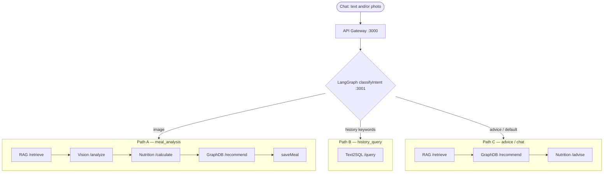

# NutriAgent AI

AI-powered nutrition tracking app with a multi-agent architecture: **LangGraph** orchestrates Vision, Nutrition, RAG, Text2SQL, and a clinical GraphDB agent.

Repository: <https://github.com/user-ai-2020/nutriagent-ai>

**For deep technical detail on every feature** (image storage, Text2SQL security, RAG pipeline, i18n, etc.), see **[docs/TASKS.md](docs/TASKS.md)**. Agent standing rules for Cursor / Antigravity: **[AGENTS.md](AGENTS.md)**. This README only covers what you need to get running and find your way around.

## Run It

Only prerequisite: Docker Desktop (or Docker Engine + Compose). No Node/pnpm install needed for this path.

```bash
cp .env.example .env
docker compose -f docker-compose.yml -f docker-compose.dev.yml up -d --build
```

Wait for the containers to become healthy (`docker compose ps`), then open:

| App | URL | Login |
|---|---|---|
| User Portal | http://localhost:3008 | `user@nutriagent.ai` / `user123` |
| Admin Portal | http://localhost:3007 | `admin@nutriagent.ai` / `admin123` |

No `OPENROUTER_API_KEY` set → the app runs in **mock mode** (sample vision/chat/RAG data, no external calls, nothing to pay for). To use real AI, add a free key from [openrouter.ai/keys](https://openrouter.ai/keys) to `OPENROUTER_API_KEY` in `.env`, then `docker compose restart`.

Stop everything: `docker compose down`.

Need the tester/grader flow (pre-built Docker Hub images), or want to run services individually with `pnpm` instead of Docker? See **Quick Start** and **Local Node dev** below.

## Architecture

Full Mermaid graphs (all three paths + sequences): **[docs/architecture/architecture-graph.md](docs/architecture/architecture-graph.md)**.



### How a request flows

Chat (text or photo) → `POST /api/chat/message` on the **API Gateway** → `POST /process` on the **Orchestrator**. The orchestrator runs a compiled **LangGraph** `StateGraph` (`services/orchestrator/src/graph.ts`), invoked from `services/orchestrator/src/index.ts`.

| Intent | Typical trigger | Graph path |
|---|---|---|
| `meal_analysis` | Image attached | RAG `/retrieve` → Vision `/analyze` → Nutrition `/calculate` → GraphDB `/recommend` → save meal |
| `history_query` | “calories today”, “מה אכלתי”, week/history | Text2SQL `/query` |
| `nutrition_advice` / `restaurant_recommendation` / `general_chat` | Keywords / default | RAG `/retrieve` → GraphDB `/recommend` → Nutrition `/advise` |

### Where each piece lives

| Piece | Location | Notes |
|---|---|---|
| **LangGraph** | `services/orchestrator` — `@langchain/langgraph`, `src/graph.ts` | Workflow / routing only; not a database |
| **GraphDB agent** | `services/graphdb-agent` — `POST /recommend` | In-memory clinical map (`CLINICAL_GRAPH`: diabetes, peanut allergy, hypertension) — PoC, not Neo4j |
| **Text2SQL** | `services/text2sql-agent` | Templates + LLM SQL → validate → scoped SELECT |
| **RAG** | `services/rag-agent` | Chat uses fast `/retrieve` (hybrid KB); full `/query` web-fallback is separate |
| **Vision / Nutrition** | `services/vision-agent`, `services/nutrition-agent` | Meal scan ensemble + macros / advice |
| **Shared cookie SSO** | `@nutriagent/shared/authCookie` | `nutriagent_token` shared across portals on the same hostname |

## Quick Start (Docker — testers & graders)

```bash
cp .env.tester.example .env    # set DOCKERHUB_NAMESPACE + OPENROUTER_API_KEY (required)
docker compose up -d           # full stack: meal scan, chat, history, admin portal
```

Get an OpenRouter key at [openrouter.ai/keys](https://openrouter.ai/keys). A short evaluation session (meal scans + chat on default models) typically costs well under $1.

Demo login: `user@nutriagent.ai` / `user123` (user app on **3008**). Admin: `admin@nutriagent.ai` / `admin123` on **Admin Portal :3007**. Signing in once on either portal writes a shared `nutriagent_token` cookie (same host: use `localhost` or `127.0.0.1` consistently — they do not share cookies). Admins already signed in on **3008** open **3007** without logging in again; role checks are unchanged (Users still get denied on the admin portal / API 403).

Developers: use @`.env.example` (mock mode works without a key). Build all app images from source instead of pulling from Docker Hub:

```bash
docker compose -f docker-compose.yml -f docker-compose.dev.yml up -d --build
```

## Run from Docker Hub

Set `DOCKERHUB_NAMESPACE` in `.env` to your Docker Hub username or org (same value as the `DOCKERHUB_USERNAME` GitHub secret). CI pushes `:latest` and a git-SHA tag on every merge to `main`; pin with `IMAGE_TAG=<sha>` if needed. First-time Hub + GitHub setup: [docs/DOCKER_HUB_SETUP.md](docs/DOCKER_HUB_SETUP.md).

## Local Node dev (optional)

```bash
pnpm install
pnpm db:generate
pnpm db:migrate
pnpm db:seed              # demo accounts
pnpm db:seed:demo         # optional: 30 days of realistic synthetic meal history
```

**Run everything:**

```bash
pnpm dev:api                              # API Gateway — 3000
cd services/orchestrator && pnpm dev      # 3001
cd services/vision-agent && pnpm dev      # 3002
cd services/nutrition-agent && pnpm dev   # 3003
cd services/rag-agent && pnpm dev         # 3004
cd services/text2sql-agent && pnpm dev    # 3005
cd services/graphdb-agent && pnpm dev     # 3006
pnpm dev:admin                            # Admin Portal — 3007
cd apps/user-portal && pnpm dev           # User Portal — 3008
pnpm dev:mobile                           # Expo — 8081
```

| Role | Email | Password |
|---|---|---|
| User | `user@nutriagent.ai` | `user123` |
| Admin | `admin@nutriagent.ai` | `admin123` |

## Troubleshooting (Docker testers)

- **Something won't start:** `docker compose ps` — look for `unhealthy` or `Exit`. Then `docker compose logs <service>` (e.g. `api-gateway`, `rag-agent`).
- **Missing config:** logs show `Missing required environment variables:` with the exact name — fix `.env` or see `.env.example` (developers only).
- **Port already in use:** stop the other app on 3000/3008, or change the host port in @docker-compose.yml.
- **History questions fail** ("how many calories today"): confirm `text2sql-agent` is healthy (`docker compose ps`). It starts by default — no special profile needed.
- **Admin portal access denied**: only users with the **Admin** role can use http://localhost:3007; regular users see a clear denial (API returns 403). If you already signed in on **3008**, **3007** reuses that session (no second login) but still enforces Admin role.
- **Admin asks for login again after 3008**: use the same hostname on both ports (`127.0.0.1` vs `localhost` are different cookie jars).
- **Meal scan or chat fails / looks broken:** confirm `OPENROUTER_API_KEY` is set in `.env` (required for testers — get one at [openrouter.ai/keys](https://openrouter.ai/keys)). Services start without a key, but AI features need it.

Developer note: if `db:migrate` can't find `DATABASE_URL`, see [docs/TASKS.md](docs/TASKS.md#environment-variables).

## Environment variables

**Testers:** @`.env.tester.example` — two required values (`DOCKERHUB_NAMESPACE`, `OPENROUTER_API_KEY`).  
**Developers:** @`.env.example` (full list; mock mode optional).

| Variable | Testers | Developers | What it's for |
|---|---|---|---|
| `DOCKERHUB_NAMESPACE` | Required | If using Docker pull | Docker Hub username/org |
| `OPENROUTER_API_KEY` | **Required** | Optional (mock without) | Live vision, reranker, RAG, chat, Text2SQL |
| `DATABASE_URL` / `JWT_SECRET` | Auto in Compose | See `.env.example` | Set by @docker-compose.yml for Docker runs |

## Project layout

```
apps/        mobile (Expo) · user-portal (Next.js) · admin-portal (Next.js)
services/    api-gateway · orchestrator (LangGraph) · vision-agent · nutrition-agent
             rag-agent · text2sql-agent · graphdb-agent
packages/    db (Prisma) · shared (types, auth cookie, locales he/en/ru, storage)
docs/        specs, ERD, and the full technical reference (TASKS.md)
infra/       GCP Terraform (Cloud Run, Cloud SQL, Memorystore)
AGENTS.md    standing instructions for AI coding agents (Cursor + Antigravity)
.agents/     Antigravity workspace skills (live-verify playbook)
```

| App/Service | Port |
|---|---|
| API Gateway | 3000 |
| Orchestrator (LangGraph) | 3001 |
| Vision Agent | 3002 |
| Nutrition Agent | 3003 |
| RAG Agent | 3004 |
| Text2SQL Agent | 3005 |
| GraphDB Agent (clinical PoC) | 3006 |
| Admin Portal | 3007 |
| User Portal | 3008 |
| Mobile (Expo) | 8081 |

## What it does

- **Meal scanning** — photo → LangGraph meal path → 3 vision models + reranker → nutrition calc → GraphDB tips → saved meal (placeholder / no-food detections are not persisted as real meals)
- **Smart chat** — LangGraph routes to Text2SQL (history), Nutrition advise + GraphDB (advice), or meal analysis when an image is attached
- **Dashboard** — calorie budget, meal split, steps
- **i18n (Hebrew / English / Russian)** — UI + AI replies; language only via Settings; RTL for Hebrew; default response language `en`
- **Dark UI** — single dark theme across portals/mobile
- **Admin panel** — separate app on **3007**; shared login cookie with user portal when hostname matches
- **Agent tooling** — Cursor and Google Antigravity both work on this repo (`AGENTS.md` + `.agents/skills/`); neither replaces the other

## AI Configuration

**Testers:** a real `OPENROUTER_API_KEY` is required (see Quick Start above) — you evaluate the live pipeline: LangGraph orchestration, vision ensemble, reranker, RAG retrieval, Text2SQL history, GraphDB clinical tips, and LLM-backed chat.

**Developers:** leave `OPENROUTER_API_KEY` empty in @`.env.example` for mock mode with sample data during local work. Model choices, RAG tuning, and Text2SQL security guarantees are in [docs/TASKS.md](docs/TASKS.md).

## Deployment (GCP)

Two supported paths — pick one:

| | Single VM | Cloud Run |
|---|---|---|
| Guide | **[docs/DEPLOY_VM.md](docs/DEPLOY_VM.md)** | **[infra/README.md](infra/README.md)** |
| How | One Compute Engine VM, Docker Compose | 9 managed services, autoscaling |
| Machine | e2-medium (4 GB) — the stack needs ~4.1 GB | scales to zero when idle |
| Database | Postgres container on the VM | Cloud SQL, private IP |
| Cost | ~$27/mo | ~$25–30/mo (Cloud SQL) + ~$35 (Redis) |
| Best for | course demo, simplest to reason about | closer to production |

**Single VM — the short version:**

```bash
# on the VM, after cloning
cp .env.production.example .env && vi .env   # set JWT_SECRET, DOCKERHUB_NAMESPACE, keys
chmod +x deploy.sh && ./deploy.sh
```

`deploy.sh` installs Docker, adds swap, pulls images, runs migrations **and the
LangGraph checkpoint tables**, seeds demo users, and starts everything.

**Cloud Run — the short version:**

```bash
GITHUB_REPO=user-ai-2020/nutriagent-ai OPENROUTER_API_KEY=sk-or-v1-... ./infra/gcp-setup.sh
git push origin main            # CI builds + pushes images
./infra/deploy-services.sh
./infra/run-migrations.sh
```

> **e2-micro (free tier) is not viable.** The stack is 11 containers totalling
> ~3.8 GB of memory limits; 1 GB cannot start it. The $300 trial credit covers an
> e2-medium for roughly 11 months.

### Secrets

No secret is ever committed. `.gitignore` denies every `.env*` variant and
re-allows only `*.example` templates. Production values live in:

- **VM:** `.env` on the machine, created from `.env.production.example`
- **Cloud Run:** Secret Manager — the DB password and `JWT_SECRET` are generated
  by `infra/gcp-setup.sh` and never printed or written to disk
- **CI:** GitHub repository secrets, with Workload Identity Federation instead of
  a long-lived service-account key

`deploy.sh` refuses to start if `JWT_SECRET` is missing or still the dev default.

## Ongoing diagnostics

While the stack runs, use `scripts/diagnostics.mjs` on demand (checks do not run automatically):

```bash
node scripts/diagnostics.mjs --once                              # run now, exit 1 if unhealthy
node scripts/diagnostics.mjs --serve                               # wait for POST http://localhost:3099/diagnostics/run
curl -X POST http://localhost:3099/diagnostics/run                 # trigger a run against serve mode
COMPOSE_PROFILES=monitor docker compose up -d diagnostic-monitor # idle server; POST to run
```

See `docker/README.md` for env vars (`DIAGNOSTIC_FAILURE_THRESHOLD`, `DIAGNOSTIC_DISABLED`).

## License

Private — Course Project
