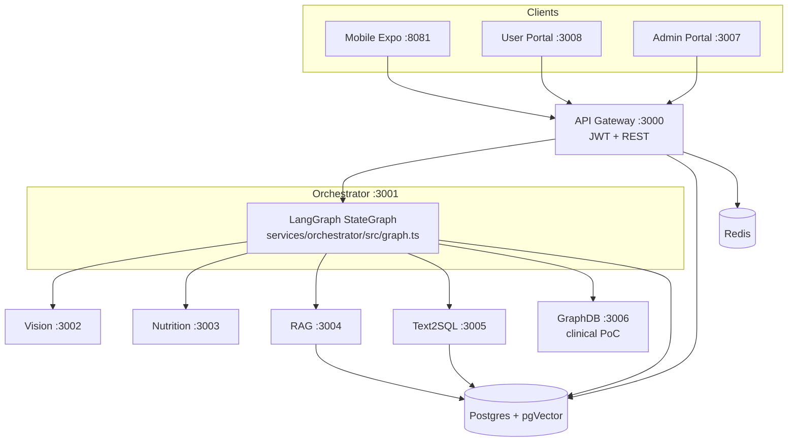
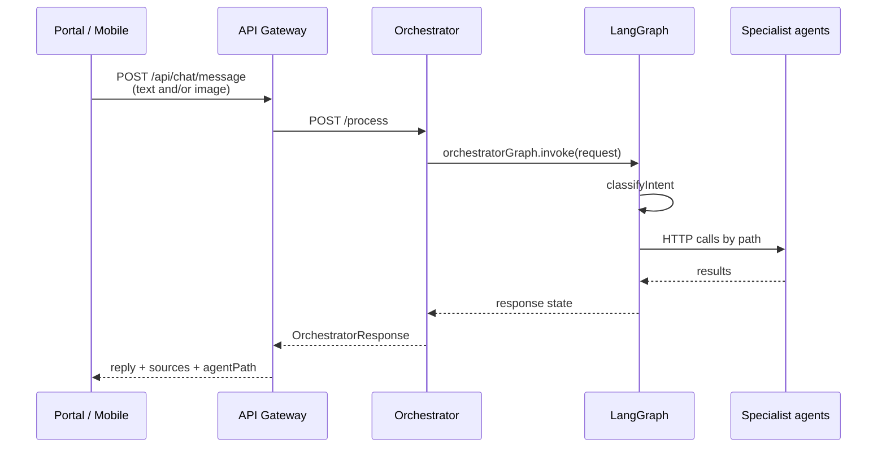
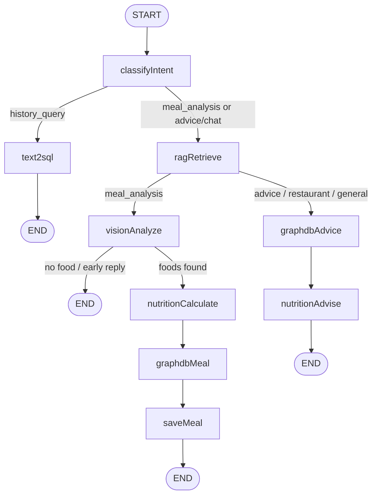
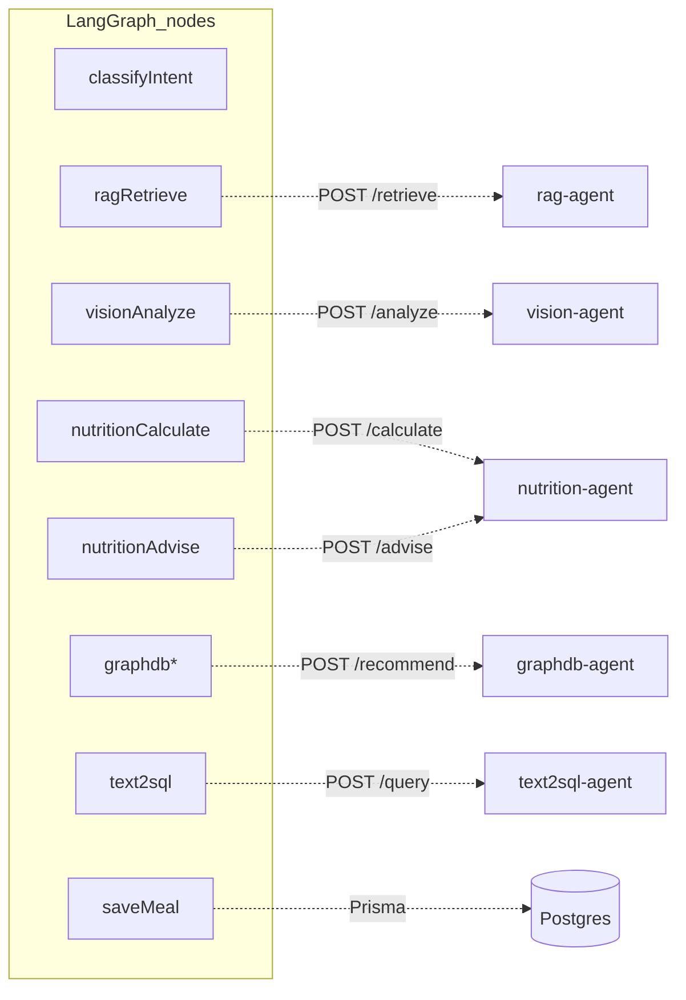
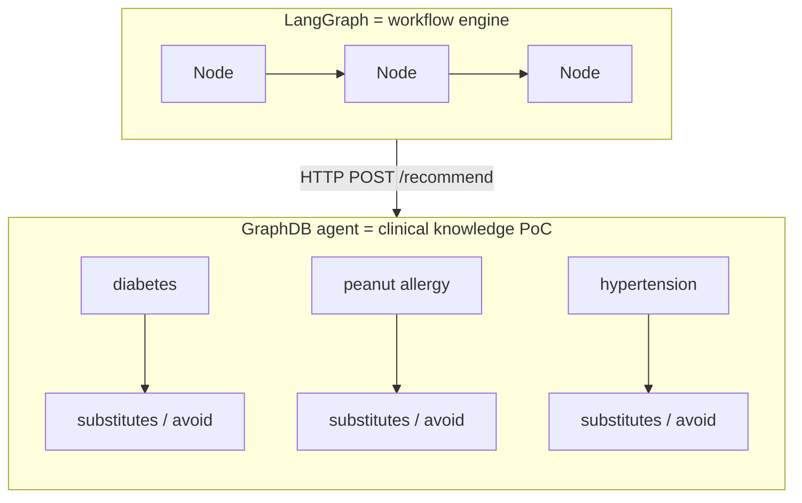
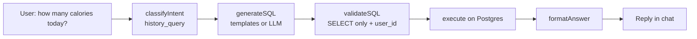
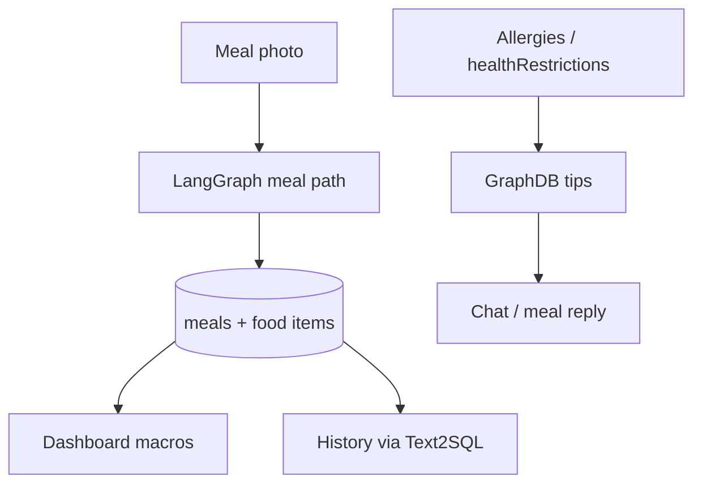

## What NutriAgent is

Three clients (mobile, user portal, admin portal) talk only to the **API Gateway**. The gateway calls the **Orchestrator**, which runs a **LangGraph** state machine. That graph decides which specialist agents to call (Vision, Nutrition, RAG, Text2SQL, GraphDB) and returns one reply.

---

## 1. System overview

| Layer | Role |
|---|---|
| **Clients** | UI only — chat, meals, settings, admin |
| **API Gateway** | Auth, `/api/chat`, meals, dashboard; forwards AI work to orchestrator |
| **Orchestrator + LangGraph** | Intent + workflow; does not “think” about food itself |
| **Agents** | One job each over HTTP |
| **Postgres** | Users, meals, embeddings (pgVector) |
| **Redis** | Supporting infra (e.g. audit/diagnostics paths) |

---

## 2. Chat / meal request path

- **Meal scan** = same chat endpoint with an image (`FormData`).
- Code: gateway `routes/chat.ts` → `callOrchestrator` → orchestrator `index.ts` → `graph.ts`.

---

## 3. LangGraph workflow (the brain)

LangGraph is **only** in the orchestrator:

- Package: `@langchain/langgraph`
- Graph: `services/orchestrator/src/graph.ts`
- Start: `orchestratorGraph.invoke({ request })` in `index.ts`

### Intent → meaning

| Intent | How it’s chosen | What happens |
|---|---|---|
| `meal_analysis` | Image attached | Detect food → macros → clinical tips → save meal |
| `history_query` | “today”, calories, “מה אכלתי”, week… | Text2SQL over **your** meals |
| `nutrition_advice` / `restaurant_recommendation` / `general_chat` | Keywords / default | RAG context + GraphDB + Nutrition advise |

---

## 4. Each agent (what + where)

| Agent | Port | Folder | Does |
|---|---|---|---|
| **Vision** | 3002 | `services/vision-agent` | Multi-model food detection + rerank |
| **Nutrition** | 3003 | `services/nutrition-agent` | Macros (`/calculate`) and chat advice (`/advise`) |
| **RAG** | 3004 | `services/rag-agent` | Hybrid KB retrieve (pgVector + keywords) |
| **Text2SQL** | 3005 | `services/text2sql-agent` | NL → safe SELECT → natural answer |
| **GraphDB** | 3006 | `services/graphdb-agent` | Clinical recommendations from profile |

---

## 5. LangGraph vs GraphDB (easy to confuse)

- **LangGraph** = how steps are ordered (router). Not a database.
- **GraphDB** = small in-memory map `CLINICAL_GRAPH` in `services/graphdb-agent/src/router.ts`. Not Neo4j. Matches allergies/healthRestrictions and returns prefer/avoid tips.

---

## 6. Text2SQL path (history questions)

---

## 7. Data the user sees

---

## One-sentence map

**UI → Gateway → LangGraph orchestrator → (Vision / Nutrition / RAG / Text2SQL / GraphDB) → Postgres**, with LangGraph choosing the path and GraphDB only answering clinical prefer/avoid tips.
