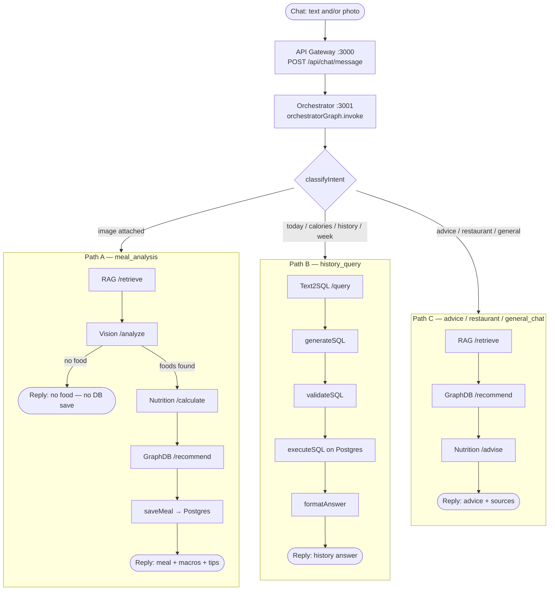
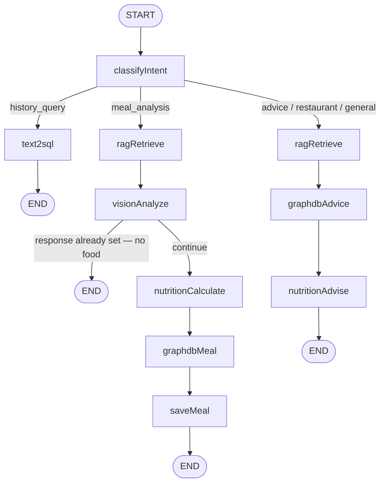
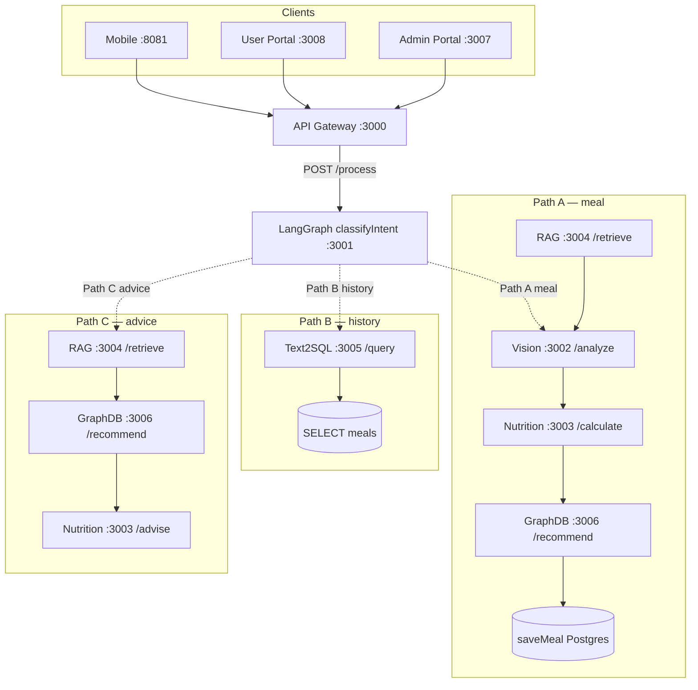
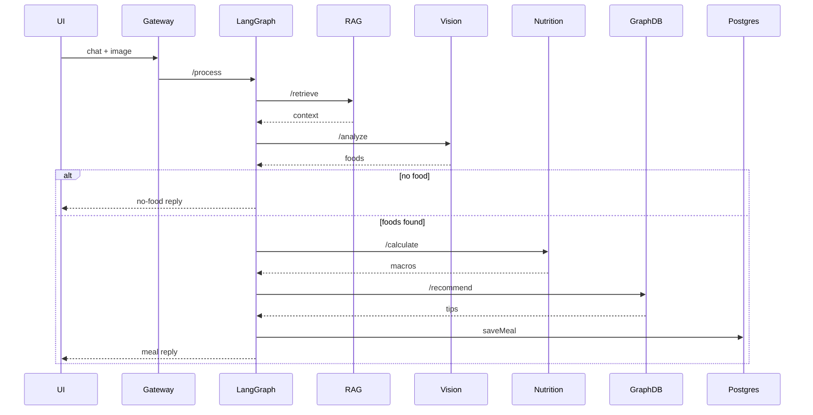
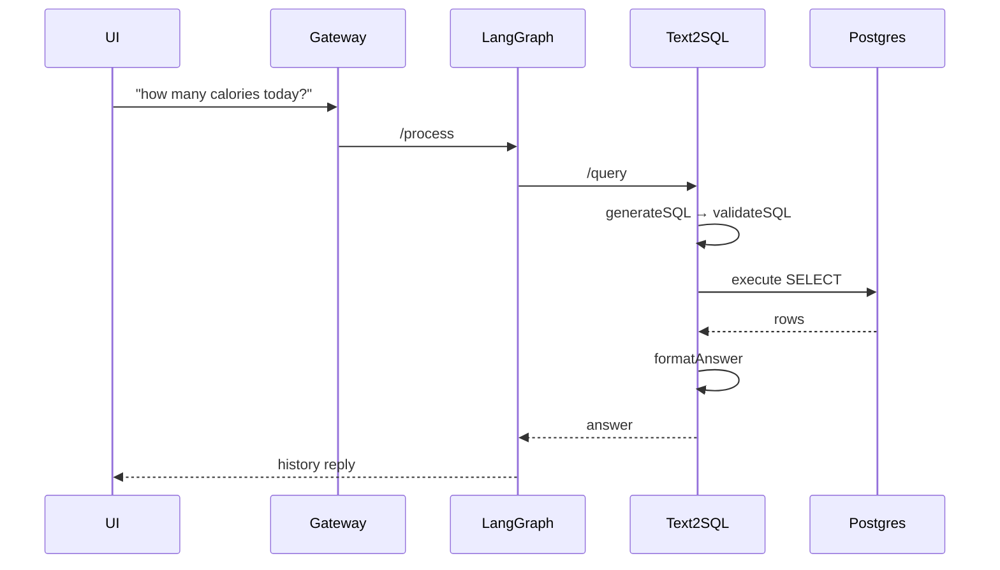
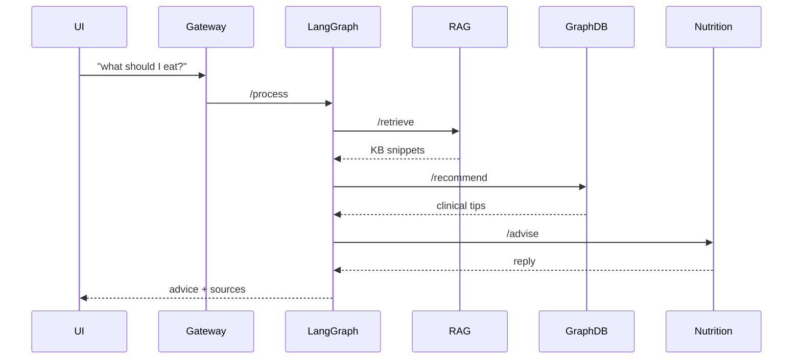
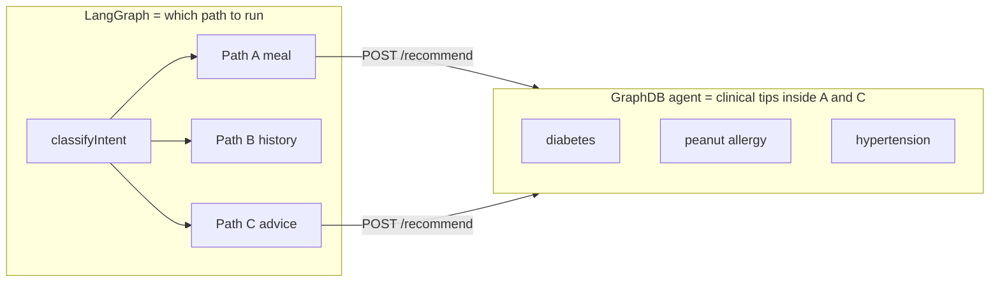

# NutriAgent AI — Architecture Graphs

Source of truth for diagrams. LangGraph code: `services/orchestrator/src/graph.ts`.

Live editor (three paths): [Open/Edit](https://l.mermaid.ai/LbFiM4)

## 1. Three LangGraph paths (main graph)

One entry → `classifyIntent` → exactly one of three paths.

| Path | Intent | Trigger | Agents in order |
|---|---|---|---|
| **A** | `meal_analysis` | Image attached | RAG → Vision → Nutrition `/calculate` → GraphDB → saveMeal |
| **B** | `history_query` | “calories today”, “מה אכלתי”, week, chart… | Text2SQL only |
| **C** | `nutrition_advice` / `restaurant_recommendation` / `general_chat` | Keywords / default | RAG → GraphDB → Nutrition `/advise` |

## 2. LangGraph nodes (matches `graph.ts`)

## 3. System map with path colors

## 4. Sequence per path

### Path A — meal

### Path B — history

### Path C — advice

## 5. LangGraph vs GraphDB

