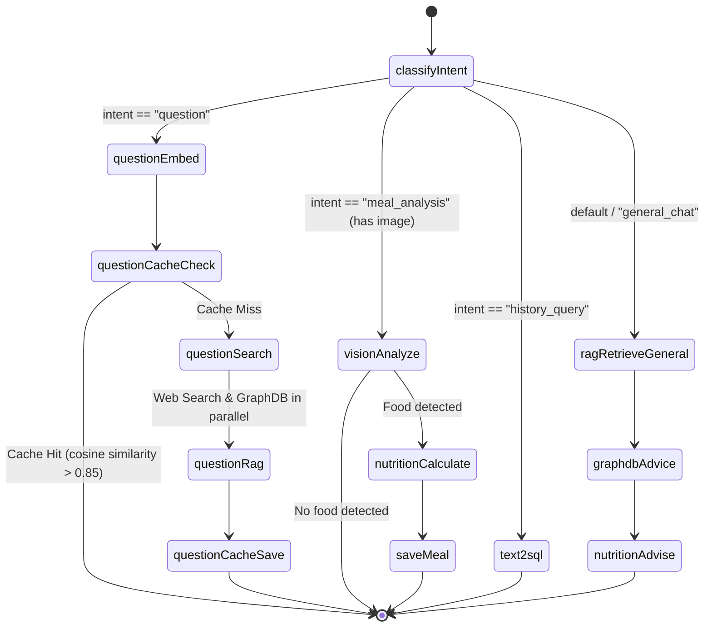

# Router Agent v2 Architecture

This document describes the updated routing architecture for NutriAgent, which employs a 4-branch intent classification to determine the flow of processing for each message. The router is implemented using `@langchain/langgraph` inside `services/orchestrator`.

## Architecture Diagram

## Branch Details

### 1. Question (Factual Query)
Handles objective fact-lookup queries.
- **Trigger**: Keywords like "what is", "how many calories in", "protein in".
- **Flow**: 
  1. Computes embedding of the user's question via OpenRouter.
  2. Queries `public.cached_answers` (with pgvector HNSW index) for matches > 0.85. If matched, returns immediately.
  3. On cache miss, performs Web Search (via RAG agent) and GraphDB Clinical lookup in parallel.
  4. Feeds retrieved context into an LLM call to synthesize an objective answer.
  5. Caches the question, embedding, and generated answer.

### 2. Vision (Meal Analysis)
Handles incoming meal photos.
- **Trigger**: Any message containing an image (`hasImage === true`).
- **Flow**:
  1. Compresses image and calls the Vision Agent (Gemini 2.5 Flash).
  2. Calls the Nutrition Agent to calculate macros if food items are detected.
  3. Builds formatting UI components, saves the meal (to `media.meal_images` and `public.meals`), and returns a macro graph.

### 3. Text2SQL (Personal History)
Handles queries relating to a user's past actions and logs.
- **Trigger**: Keywords like "history", "average", "I ate", "today", "yesterday".
- **Flow**:
  1. Sends query to Text2SQL Agent.
  2. Agent executes SQL (enforced with Row Level Security) against `public.meals` and `activity.exercise_logs`.
  3. Returns the generated report.

### 4. General Chat (Advice & Conversational)
Handles subjective queries, dietary recommendations, and greetings.
- **Trigger**: Fallback branch (and explicit terms like "what should I eat", "recommend").
- **Flow**:
  1. Retrieves static knowledge base context via RAG (no web fallback).
  2. Looks up safe clinical recommendations via GraphDB Agent.
  3. Generates conversational advice using the Nutrition Agent.
