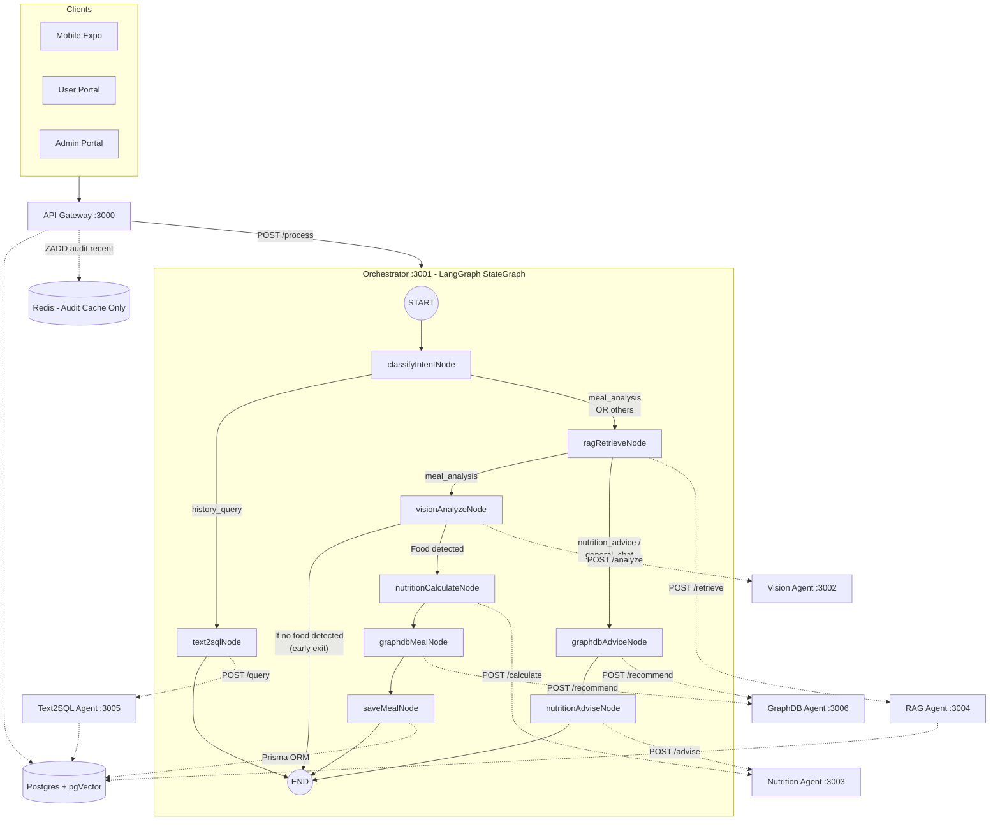

# Verified Architecture Document (Source-Code Ground Truth)

*This document was generated by auditing the actual source code, explicitly overriding any legacy or contradictory documentation.*

## 1. Orchestrator Implementation (LangGraph Confirmed)

Previous documentation may have contained contradictory claims about the Orchestrator being a simple imperative router. **This is false.** The Orchestrator is a genuine LangGraph implementation.

- **File**: `services/orchestrator/src/graph.ts` exists and defines a full `StateGraph` (line 316).
- **Dependency**: `services/orchestrator/package.json` explicitly depends on `"@langchain/langgraph": "^1.4.8"` (line 13).
- **Entry Point**: The graph is compiled at `services/orchestrator/src/graph.ts:350` (`export const orchestratorGraph = workflow.compile();`) and is invoked by the HTTP POST endpoint in `services/orchestrator/src/index.ts:11` (`app.post("/process")`).

## 2. Intent Routing Logic

The real routing logic is defined in `classifyIntent` located in `services/orchestrator/src/utils.ts:96-148`.
The exact priority order of classification is:

1. **`meal_analysis`**: Selected immediately if `hasImage` is true (line 98).
2. **`restaurant_recommendation`**: Selected if message contains "restaurant", "מסעדה", or "menu" (line 99).
3. **`nutrition_advice`**: Selected if message contains advising words like "what should i eat", "recommend eat", "מה כדאי" (line 102).
4. **`nutrition_advice`**: Selected if message contains "calorie", "protein", "diet" AND DOES NOT contain past-tense words like "yesterday", "today", "אכלתי" (line 114).
5. **`history_query`**: Selected if message contains "how many", "history", "average", "אכלתי", "graph", etc (line 130).
6. **`general_chat`**: The fallback for everything else (line 147).

### StateGraph Flow Sequences
The LangGraph edges defined in `services/orchestrator/src/graph.ts:318-348` dictate the exact execution order:

- **Meal Analysis Branch** (`meal_analysis`):
  1. `ragRetrieveNode` (Retrieves context)
  2. `visionAnalyzeNode` (Calls Vision Agent)
     - *Early Exit Path*: If no food is detected (`isEmptyVisionDetection` at line 108), a response is built immediately, and the graph routes to `END` (line 329).
  3. `nutritionCalculateNode` (Calculates macros via Nutrition Agent)
  4. `graphdbMealNode` (Gets clinical alerts from GraphDB)
  5. `saveMealNode` (Saves meal to Postgres and formats response)
  6. `END`

- **History Query Branch** (`history_query`):
  1. `text2sqlNode` (Calls Text2SQL Agent)
  2. `END`
  *(Note: RAG is completely bypassed for this intent)*

- **Advice / Chat Branch** (`nutrition_advice`, `restaurant_recommendation`, `general_chat`):
  1. `ragRetrieveNode` (Retrieves context)
  2. `graphdbAdviceNode` (Gets clinical safe foods from GraphDB)
  3. `nutritionAdviseNode` (Generates LLM response via Nutrition Agent)
  4. `END`

## 3. Shared vs Duplicated Steps

Contrary to any previous diagrams that might show separate RAG nodes, the **RAG retrieval step is shared**. 
The `ragRetrieveNode` (`services/orchestrator/src/graph.ts:64`) executes directly after intent classification for both `meal_analysis` and `nutrition_advice`/`general_chat`. It is a single node in the graph that branches conditionally *after* execution (line 324).

## 4. Services Inventory

Based on `src/index.ts` and `src/router.ts` files across the `services/` directory:

| Service | Port | Verified Endpoints |
|---------|------|--------------------|
| **api-gateway** | 3000 | `GET /health`, `GET /`, and standard REST routes (auth, meals, admin) |
| **orchestrator** | 3001 | `GET /health`, `POST /process` |
| **vision-agent** | 3002 | `GET /health`, `POST /analyze` |
| **nutrition-agent** | 3003 | `GET /health`, `POST /calculate`, `POST /advise` |
| **rag-agent** | 3004 | `GET /health`, `POST /retrieve` |
| **text2sql-agent** | 3005 | `GET /health`, `POST /query` |
| **graphdb-agent** | 3006 | `GET /health`, `POST /recommend` |

## 5. Data Layer (Postgres & Redis)

### Postgres Schema (`packages/db/prisma/schema.prisma`)
- **pgVector is REAL and enabled.** The schema explicitly includes `extensions = [vector]` (line 9).
- Vector columns exist on `KnowledgeDocument` (`Unsupported("vector")`, line 185) and `RagChunk` (`Unsupported("vector(1024)")`, line 234). 
- Full text search is also configured natively via `Unsupported("tsvector")` on `RagChunk`.

### Redis Usage
- **Sessions are NOT stored in Redis.** 
- Redis is strictly used as an **Audit Log Cache**. According to `packages/shared/src/audit.ts` (lines 28-35) and `services/api-gateway/src/lib/redis.ts`, Redis writes to the `audit:recent` sorted set (`ZADD`, `ZREVRANGE`) to buffer and quickly retrieve audit events. If Redis is down, it falls back gracefully. There is no active session caching in the codebase.

---

## Verified Mermaid Flowchart

## Documentation Corrections

Based on the verified ground truth, here are things that previous documentation might have gotten wrong:

1. **Orchestrator Architecture**: Any claim that the orchestrator is "plain imperative if/else routing" is false; it is a compiled LangGraph `StateGraph`.
2. **RAG Duplication**: RAG is not called separately in each branch. It is a shared node that executes immediately after classification (except for history queries).
3. **Redis Session Storage**: If any doc claims Redis is used for user sessions or rate limiting, it is incorrect. It is exclusively used for caching recent Audit Logs (`ZADD audit:recent`).
4. **Early Exit on Vision**: The meal path does not strictly proceed to the end if no food is detected; it early-exits directly from `visionAnalyzeNode` to `END` if `isEmptyVisionDetection` is true.
