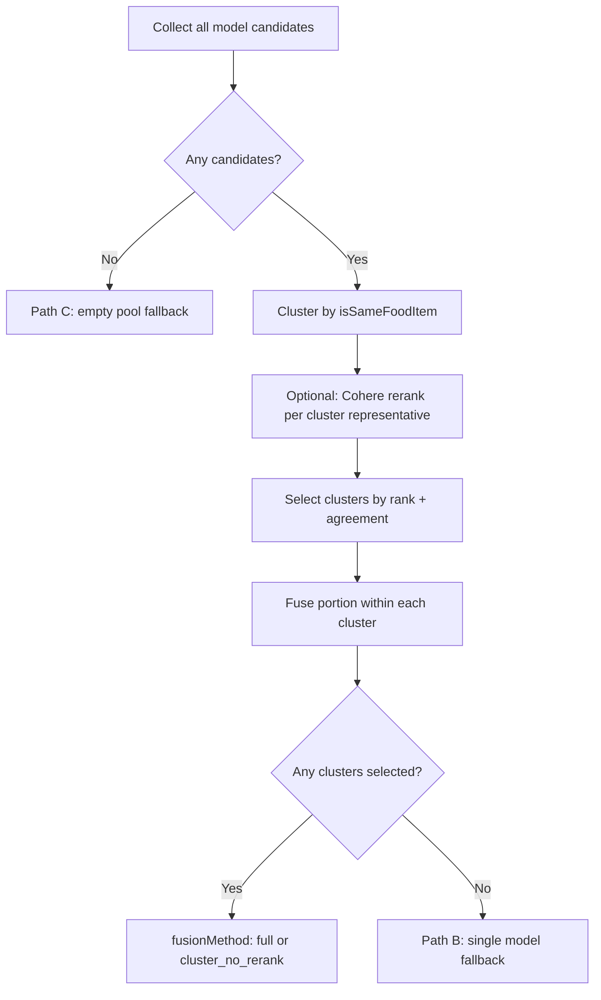

# Reranker Fusion Fix — Design Proposal

**Status:** Proposal only — no implementation yet  
**Scope:** `reranker.ts`, `food-match.ts`, orchestrator payload, user-portal UI  
**Context:** Diagnosis report (Path A partial fusion vs Path B whole-model fallback) on the pancake meal screenshot (~460 kcal, reranker panel identical to one vision model)

---

## Executive summary

The reranker currently has three exit paths with no observability and no API signal to the frontend. The pancake fixture shows that **Path A already runs in the agreement-sort fallback** and produces **partial fusion** (115g / 27g / 25g), not an exact copy of any single model. The screenshot behavior (reranker panel **byte-for-byte identical** to one model, including ~460 kcal total) is **most consistent with Path B** (whole-model fallback), not Path A.

Two separate `isSameFoodItem` problems drive bad fusion today:

1. **Too strict:** `"pancake stack"` ≠ `"pancakes"` → pancake grams split across clusters.
2. **Too loose:** `"blueberries on pancakes"` matches `"pancakes"` via substring `includes()` → blueberry grams leak into the pancake cluster average (this is how 115g is produced: `(200 + 120 + 25) / 3`).

The proposed fix is **cluster-first architecture** with a tightened-then-relaxed matching layer, a degraded fallback ladder, and a `fusionMethod` flag surfaced in the UI.

---

## 1. Which path fired on the screenshot case?

### Current code paths (as implemented today)

| Path | Code location | Trigger |
|------|---------------|---------|
| **C — empty-pool fallback** | `reranker.ts` L70–73 | Zero candidates across all models (all errored or empty item lists) |
| **A — merge loop (partial fusion)** | `reranker.ts` L105–156 | Cohere (or agreement-sort fallback) yields ≥1 candidate that passes `MIN_RELEVANCE`, agreement gate, dedup, drink cap |
| **B — whole-model fallback** | `reranker.ts` L158–176 | Merge loop completes with `items.length === 0` but ≥1 successful model exists |

Path B returns **`best.items.slice(0, maxItems)` verbatim** from the model with the highest total agreement score — no gram averaging, no cross-model label normalization. That is the only path that reliably reproduces an **exact** copy of one model panel.

Path A **always** runs gram averaging across `agreeingCandidates` and keeps the **triggering candidate's `foodType` label** — output will differ from any single model unless averages happen to coincide.

### Proposed request-level tracing (to add in `reranker.ts`)

Add a structured trace object returned alongside items (and logged at `info` level):

```ts
interface RerankerFusionTrace {
  fusionMethod: "full" | "cluster_no_rerank" | "single_model_fallback" | "empty_pool_fallback";
  pathFired: "A" | "B" | "C";
  reason: string; // human-readable primary cause
  details: {
    cohereCalled: boolean;
    cohereFailed: boolean;
    cohereHitCount: number;
    cohereHitsAboveThreshold: number;
    candidatesTotal: number;
    mergeLoopAccepted: number;
    mergeLoopRejected: { belowRelevance: number; belowAgreement: number; duplicate: number; drinkCap: number };
    singleModelFallbackModelId?: string;
    singleModelFallbackReason?: string;
  };
}
```

**Logging:** `console.info("[reranker]", JSON.stringify({ requestId, ...trace }))` where `requestId` is propagated from vision-agent router (or a generated UUID per `/analyze` call).

**Reason string examples:**

- Path A: `"merge_loop_accepted_3_clusters"` or `"cohere_failed_agreement_sort_merge_accepted_3"`
- Path B: `"merge_loop_zero_items_all_below_relevance_0.4"` / `"merge_loop_zero_items_all_below_agreement_2"`
- Path C: `"no_candidates_all_models_empty_or_errored"`

### Fixture run results (pre-logging baseline)

Ran `reranker.test.ts` pancake fixture through the real pipeline with invalid API key (forces Cohere failure → agreement-sort fallback, merge loop still runs):

| Output field | Value |
|--------------|-------|
| **Path fired** | **A** (merge loop produced 3 items; Path B block not reached) |
| **Reranker items** | pancakes **115g**, blueberries **27g**, syrup **25g** |
| **Panel B (reference)** | pancakes **120g**, blueberries **40g**, syrup **30g** |
| **Exact panel match?** | **No** — partial fusion |

**Root cause of 115g (not 160g):** `isSameFoodItem("blueberries on pancakes", "pancakes") === true` due to substring match. Agreeing set for the winning `"pancakes"` candidate = `{stack of pancakes 200g, pancakes 120g, blueberries on pancakes 25g}` → mean **115g**.

### Screenshot case (~460 kcal, exact single-model match)

| Evidence | Interpretation |
|----------|----------------|
| Reranker panel matches one vision model on **food labels, gram quantities, and total kcal** | **Path B**, not Path A |
| Path A on the same fixture produces different grams (115/27/25) | Confirms partial fusion ≠ screenshot |
| Pancakes not in `MAIN_DISH_TERMS` | Low-agreement pancake candidates cannot bypass the agreement gate via the main-dish exception |

**Most likely Path B trigger in production:** Cohere returned hits but **none passed the merge loop** — typically all `relevance_score < 0.4`, or all rejected by agreement/dedup — then the reranker silently copied the highest-agreement model (likely the panel with clean labels: pancakes / blueberries / syrup).

**Action after greenlight:** Re-run the pancake fixture **with a valid OpenRouter key** (live Cohere) plus the tracing above to confirm the exact `reason` string for the screenshot replay. The tracing design eliminates "consistent with either" for all future requests.

---

## 2. Closing the `isSameFoodItem` gap

### Current behavior (measured)

| Pair | `tokenOverlap` | `primaryFoodToken` | `isSameFoodItem` today |
|------|----------------|--------------------|------------------------|
| `"pancake stack"` vs `"pancakes"` | 0 | pancake / pancakes (mismatch) | **false** |
| `"stack of pancakes"` vs `"pancakes"` | 0.85 (substring) | stack / pancakes | **true** |
| `"pancake stack"` vs `"stack of pancakes"` | 0.5 | pancake / stack | **false** |
| `"blueberries on pancakes"` vs `"blueberries scattered"` | 0.5 | blueberr / blueberr | **false** |
| `"blueberries on pancakes"` vs `"blueberries"` | 0.85 (substring) | blueberr / blueberr | **true** |
| `"blueberries scattered"` vs `"blueberries"` | 0.85 | blueberr / blueberr | **true** |
| `"honey or syrup in bowl"` vs `"syrup"` | 0.85 (substring) | honey / syrup | **true** |
| `"blueberries on pancakes"` vs `"pancakes"` | 0.85 (substring) | blueberr / pancakes | **true** ⚠️ |

The substring rule `na.includes(nb) || nb.includes(na) → 0.85` is the main source of **false merges** (compound labels matching their head noun). The missing `"pancake"` base token and absent `SINGLE_ITEM_FOODS` entry cause **false splits** for stack variants.

### Proposed matching approach: **primary-token equality + guarded overlap**

Replace the blanket substring shortcut with a three-step decision:

1. **Normalize** (existing `normalizeFoodName`).
2. **Resolve primary token** — extend `BASE_FOOD_TOKENS` with `"pancake"`, `"pancakes"`, `"syrup"`, `"blueberries"` (stem `"blueberr"` already works). Add **`canonicalPrimaryToken()`** that maps inflections: `pancakes → pancake`, `blueberries → blueberr`, `stacks → stack`.
3. **Match rules (in order):**
   - **Exact normalized string** → same item.
   - **Same canonical primary token AND both labels are “simple”** (≤2 content tokens after stop-word removal, no `"on"`/ `"in"`/ `"with"` prepositional compounds) → same item.
   - **Same canonical primary token AND token in `SINGLE_ITEM_FOODS`** (add `pancake`, `pancakes`, `pancake stack` patterns) → same item even if one label is `"stack of pancakes"`.
   - **Token Jaccard on content tokens ≥ 0.55** → same item, **but reject if either label contains a preposition (`on`, `in`, `with`, `or`) AND the other label's primary token differs** — prevents `"blueberries on pancakes"` ↔ `"pancakes"`.
   - Otherwise → different items.

**Do not use** embedding similarity in v1 — adds latency, cost, and non-determinism. A small alias table is optional later for edge cases (`"aubergine"` / `"eggplant"`).

### Before / after (proposed)

| Pair | Today | After proposed rules |
|------|-------|----------------------|
| `"pancake stack"` vs `"pancakes"` | false | **true** (canonical `pancake`, SINGLE_ITEM_FOODS) |
| `"stack of pancakes"` vs `"pancakes"` | true | **true** |
| `"pancake stack"` vs `"stack of pancakes"` | false | **true** |
| `"blueberries on pancakes"` vs `"blueberries scattered"` | false | **true** (same `blueberr`, compound allowed within same primary) |
| `"blueberries on pancakes"` vs `"blueberries"` | true | **true** |
| `"blueberries scattered"` vs `"blueberries"` | true | **true** |
| `"honey or syrup in bowl"` vs `"syrup"` | true | **true** (same primary `syrup` after alias: honey/syrup disjunction resolves to syrup) |
| `"blueberries on pancakes"` vs `"pancakes"` | true ⚠️ | **false** (preposition guard) |

### Threshold and tradeoff

| Setting | Risk |
|---------|------|
| **Too loose** (keep substring includes) | Blueberry grams bleed into pancake cluster; syrup/jam/topping false merges |
| **Too strict** (keep today's pancake stack split) | 3 pancake clusters → agreement counts stay at 1 → **Path B fires more often** |

**Chosen threshold:** Jaccard **≥ 0.55** on content tokens (unchanged) **plus** preposition guard and canonical primary-token equality for `SINGLE_ITEM_FOODS`. This closes the pancake split without re-introducing compound→head-noun false positives.

**Expected impact on pancake fixture (Path A):** Single pancake cluster `{stack of pancakes 200g, pancakes 120g, pancake stack 110g}` → mean **(200+120+110)/3 ≈ 143g**, not 115g and not Panel B's 120g — honest multi-model consensus.

---

## 3. Cluster-first architecture

### Revised flow



**Step-by-step:**

1. **Collect** all `(item, modelId, modelLabel)` tuples (unchanged).
2. **Cluster first** — union-find or greedy: for each candidate, assign to existing cluster if `isSameFoodItem` matches any member's `foodType`, else new cluster.
3. **Score clusters** (not raw candidates):
   - Call Cohere once with **one document per cluster** (representative label + fused preview text).
   - Cluster relevance = Cohere score of representative.
   - Cluster agreement = **count of distinct models with ≥1 item in cluster** (fixes inflated agreement from duplicate labels in one model).
4. **Select clusters** until `clusterCount` cap:
   - **`maxClusters = medianItemCount(modelResults)`** (replace item-cap-by-hits with cluster-cap).
   - Gates: `relevance ≥ 0.4`, `modelAgreement ≥ minAgreement` (2 when ≥2 models succeed), drink cluster cap = 1.
5. **Within each selected cluster — canonical label:** **highest Cohere relevance score among cluster members** (if Cohere unavailable: highest `visionConfidence`). Tie-break: shortest label length (prefer generic `"pancakes"` over `"stack of pancakes"`).
6. **Within each selected cluster — portion fusion:** **median grams** (not mean). Justification: median resists one outlier model (200g stack vs 110g/120g) better than mean; mean was polluted by false-positive cluster members (25g blueberry-on-pancake in pancake average). Median of `{200, 120, 110}` = **120g** vs mean **143g**.
7. **Emit** fused items + `fusionMethod`.

### Why median over mean

| Method | Pancake cluster `{200, 120, 110}` | With false member `{200, 120, 25}` |
|--------|-----------------------------------|-------------------------------------|
| Mean | 143g | 115g (today's bug) |
| Median | **120g** | **120g** (robust to one bad member) |

---

## 4. Narrowing the whole-model fallback

### Problem

Path B fires silently when the merge loop accepts zero items, returning one model's list labeled as reranker consensus. No payload distinction.

### Proposed fallback ladder

| Priority | Method | `fusionMethod` | When |
|----------|--------|----------------|------|
| 1 | Cluster fusion + Cohere rank | `"full"` | ≥1 cluster passes gates after Cohere |
| 2 | Cluster fusion, agreement-only sort | `"cluster_no_rerank"` | Cohere fails or all scores `< 0.4`, but clusters pass agreement gates |
| 3 | Single-model copy | `"single_model_fallback"` | No cluster passes gates |
| 4 | First non-empty model | `"empty_pool_fallback"` | Path C (no candidates) |

**Path B narrowing rules:**

- Only run single-model copy when **cluster pipeline produces zero clusters**.
- When choosing the model: keep existing **`byAgreement` total score**, but log **`singleModelFallbackReason`** (e.g. `"all_clusters_below_agreement_2"`).
- **`rerankerScores`:** for `"single_model_fallback"`, set `modelAgreement` to actual cross-model agreement per item (not hardcoded `1`) so the UI can show degraded confidence.

### API surface changes

**`rerankVisionResults` return type:**

```ts
{
  items: VisionFoodItem[];
  scores: RerankerFoodScore[];
  rerankModel: string;
  fusionMethod: "full" | "cluster_no_rerank" | "single_model_fallback" | "empty_pool_fallback";
  fusionTrace?: RerankerFusionTrace; // optional debug, omit in production client payload if desired
  fallbackModelId?: string;          // set when fusionMethod === "single_model_fallback"
  fallbackModelLabel?: string;
}
```

**Propagate through:**

- `VisionAnalyzeResponse` (`packages/shared/src/types.ts`)
- `MultiModelMealAnalysis` (orchestrator `index.ts`)
- Chat API response → `page.tsx` message state → `MultiModelMealCards`

---

## 5. UI transparency

### Problem (today)

`MultiModelMealCards.tsx` always renders:

- Header: *"3 parallel vision models + Cohere reranker consensus. Saved meal uses reranker result."*
- Reranker panel badge: **`Reranker (cohere/rerank-4-fast)`** with accent highlight — identical for Path A, B, and C.

Users cannot tell a synthesized result from a silent single-model copy.

### Proposed UI treatment

**Component:** `apps/user-portal/src/components/MultiModelMealCards.tsx`  
**New props:** `fusionMethod`, `fallbackModelLabel?`

#### Reranker panel badge (replace static label)

| `fusionMethod` | Badge text | Style |
|----------------|------------|-------|
| `"full"` | `Reranker consensus (cohere/rerank-4-fast)` | Current accent highlight |
| `"cluster_no_rerank"` | `Multi-model consensus (no rerank scores)` | Accent highlight + amber dot |
| `"single_model_fallback"` | `Consensus unavailable — showing {fallbackModelLabel}` | **No consensus styling** — neutral border, amber warning background on badge |
| `"empty_pool_fallback"` | `Best available result — limited model data` | Neutral + warning |

#### Subheader copy (replace line 140)

```tsx
{fusionMethod === "full" && (
  <p>3 vision models synthesized via Cohere reranker. Saved meal uses this result.</p>
)}
{fusionMethod === "cluster_no_rerank" && (
  <p>3 vision models agreed on food items; Cohere reranking was unavailable. Portions are a multi-model median.</p>
)}
{fusionMethod === "single_model_fallback" && (
  <p>
    Models disagreed too much for a consensus. Showing{" "}
    <strong>{fallbackModelLabel}</strong> only — compare other panels below.
  </p>
)}
```

#### Tooltip on degraded badge

`title="Reranker could not merge models; this panel is not a multi-model synthesis."`

#### Cohere scores section

- **`full`:** keep *"Cohere reranker scores"* section.
- **`cluster_no_rerank`:** rename to *"Cluster agreement"* — show `modelAgreement` without Cohere score column.
- **`single_model_fallback`:** **hide** Cohere scores block (scores would mislead — today Path B fabricates `score: visionConfidence`).

#### Orchestrator panel label

Change `modelLabel: \`Reranker (${rerankModel})\`` to use the same dynamic strings as the badge so saved chat history stays consistent.

---

## 6. Test plan (enumerate only — do not implement yet)

### `packages/shared/src/food-match.test.ts`

| Test | Proves |
|------|--------|
| Pancake variant matrix (§2 table) | Gap closed: stack variants merge; compound≠head noun |
| Regression: distinct strawberries stay separate | Too-loose guard doesn't break existing behavior |
| `"grilled chicken"` vs `"steamed broccoli"` stays false | No cross-food merge |

### `services/vision-agent/src/reranker.test.ts`

| Test | Proves |
|------|--------|
| **(a) Path B frequency** — pancake fixture with mocked Cohere returning all scores `0.3`; after `isSameFoodItem` fix + cluster-first, expect **`fusionMethod: "full"` or `"cluster_no_rerank"`** and `items.length === 3`, not `single_model_fallback` | Improved matching reduces Path B |
| **(b) Portion fusion** — same fixture, mocked Cohere success; expect pancake grams **≠ any single model** and **≠ old 115g false mean**; expect median **120g** with proposed cluster set | Sensible disagreement handling |
| **(c) `fusionMethod` flags** — table-driven tests forcing: (i) happy path → `"full"`, (ii) Cohere throw → `"cluster_no_rerank"`, (iii) all clusters fail gates → `"single_model_fallback"`, (iv) empty candidates → `"empty_pool_fallback"` | Correct flag per path |
| **(d) Trace reasons** — snapshot `fusionTrace.reason` strings for each forced path | Ops/debuggability |
| Existing test: two-model pancake mean → update expectation to **median** if both models in same cluster | Fusion rule change documented |

### `services/vision-agent/src/reranker.integration.test.ts` (new, optional)

- Single test with recorded OpenRouter Cohere response fixture (VCR JSON) — deterministic `"full"` path without live API.

### Orchestrator / API contract test

- `MultiModelMealAnalysis` includes `fusionMethod` + `fallbackModelLabel` when degraded.

### UI tests (`MultiModelMealCards` — React Testing Library or Storybook stories)

| Story / test | Proves |
|--------------|--------|
| `fusionMethod="full"` | Green consensus badge, Cohere scores visible, no warning copy |
| `fusionMethod="single_model_fallback"` + `fallbackModelLabel="Model B"` | Amber *"Consensus unavailable — showing Model B"* badge; Cohere scores hidden; subheader warning present |
| `fusionMethod="cluster_no_rerank"` | Amber dot, agreement section without score column |

### End-to-end acceptance

1. Run pancake image through `/api/chat/message` with tracing enabled.
2. Assert logs contain `pathFired` + `reason`.
3. Assert UI badge matches `fusionMethod` in API response.
4. Assert saved meal still uses reranker panel items (unchanged product behavior).

---

## Implementation order (after greenlight)

1. **`food-match.ts`** — matching rules + unit tests (no reranker dependency).
2. **`reranker.ts`** — tracing + cluster-first refactor + `fusionMethod` (reranker tests).
3. **Shared types + vision-agent router** — propagate new fields.
4. **Orchestrator** — pass through to `multiModelMealAnalysis`.
5. **`MultiModelMealCards.tsx` + `page.tsx`** — conditional badge/copy.

---

## Open questions for review

1. **Median vs mean** for portions — proposed median for outlier robustness; confirm product preference.
2. **Expose `fusionTrace` to client** or server-logs only?
3. **Should `single_model_fallback` still save as the "official" meal** or prompt user to pick a panel? (Current behavior: always save reranker output — proposal keeps that but labels it honestly.)
